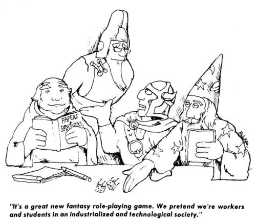

# Table of Contents

0.0 Introduction
0.1 Foreward
0.2 Preface
0.3 Dice
0.4 Glossary

1.0 Character Generation
1.1 Example of Play
1.2 Luck Rating
1.3 Characteristics
1.4 Professions
1.5 Skills
1.6 Personality
1.7 Starting Equipment

2.0 Actions and The Environment
2.1 Time and Core Mechanic
2.2 The Resistentialist Environment
2.3 Tactical Task Resolution
2.4 Strategic Task Resolution
2.5 Damage and Healing
2.6 Equipment in Detail

3.0 Non-Player Characters
3.1 Labourers
3.2 Scientists
3.3 Administrators
3.4 Technicians
3.5 Researchers
3.6 Managers

4.0 The Boss Book
4.1 Being The Boss
4.2 Running The Session
4.3 Season and Episode Design

5.0 Scenarios
5.1 Season 1, Episode 1
5.2 Season 1, Episode 2
5.3 Season 1, Episode 3
5.4 Season 1, Episode 4
5.5 Season 1, Episode 5

6.0 Appendicies
6.1 Source Material
6.2 Charts and Tables
6.3 Business Organisation Chart
6.4 Dramatis Personae
6.5 Résumé

# 0.0 Introduction

## 0.1 Foreword

## 0.2 Preface

Welcome to "Papers and Paychecks: The Roleplaying Game of an Industrialized and Technological Society" in which you play the part of workers and students glorious trying to succeed against a world of antagonists, and antagonistic world. One player, "The Boss", will help you build a story by positing projects and placing obstacles that will challenge the player's characters from completing the objectives of their projects. 

The title comes from the memorable artwork of Will McLean in the first edition of the "Advanced Dungeons & Dragons" Dungeon Masters Guide. A cursory search will reveal that on more than one occasion the thought has entered the heads of others that "Papers and Paychecks" would make a great roleplaying game, but this is the first time that the idea has seen completion. Of course, few workers these days deal as much with "papers", let alone "paychecks", but the game would hardly have the same ring to it if it was called "Emails and Direct Deposits". Such is the nature of being in a "industralized and technological society".

Roleplaying games have been an enormous success story in recent decades, starting with the original table-top versions and even some computer versions, in aggregate reaching out to tens of millions of people worldwide. The opportunity is provided in these games to engage in improvised storytelling within the structure of a rules system. The rules keeps the storytelling within the bounds of plausibility and the character's capabilities with some level of consistency. 

Note the word 'plausibility'. "Papers and Paychecks" posits a world that is downright hostile to the player characters. The metaphysical foundation, if you like, is resistentialism. This is a supposedly joke philosophy based around the widespread anecdotal evidence of an apparent malice of inanimate objects against people, the word itself coined by Paul Jennings in 1948 as a response to existentialism, and claimed that it was developed by a fictional character, Pierre-Marie Ventre (a play on the name Jean-Paul Sartre).

But of course we all know better than that. Let our motto be: "Les choses sont contre nous" ("Things are against us"). Resistentialism and it has a long and established history well prior to Jennings, as encapsulated by "Murphy's Law" (itself possibly my the mathematician de Morgan, but he already has his own law) and completely expressed by Finagle's Law of Dynamic Negatives, by John W. Campbell, science fiction writer and editor: "Anything that can go wrong, will go wrong and at the worst possible time".

Others characters in the story don't even have to be antagonistic - they may even be driven by pure motives, yet the the time in which they decide to incompetently help proves disasterous. It is the role of The Boss to ensure that this happens. Ranging from slapstick, absurdity, and even a touch of malevolence, these situational comedies can used to reminisce, inform, and inspire.

Although presented partially as a spoof, "Papers and Paychecks" is nevertheless a traditional roleplaying game, by what is meant is that it consists of several players, each taking a character (a "player-character" or PC) and their role in a story scenario designed by another player, The Boss, who adjudicates the expressed actions of the player's characters and the environment in which they occur, including the activities of non-player characters (NPCs), and introduces new plot elements as appropriate to generate a narrative flow. Usually it is played face-to-face, engaging in the primitive behaviour of actual physical socialisation, it can also be played in electronic communication as well, although real-time communication is recommended over asynchronous methods. 

There are five chapters to this book which explains tha game and how to play it. The first chapter is dedicated to character generation, covering the setting and an example of play, before illustrating the steps to build one's own player-character. This include the PCs characteristics, profession and wage band, their talents, personality, and starting equipment. For thos familiar with roleplaying games, this is a standard system but with the addition of the Luck attribute for narrative purposes.

By the end of the first chapter, the player is ready for action in an antagonistic enviroment, and the second chapter explains in detail exactly what sort of activities they can engage in. This includes an elaboration of the core mechanic game system, the tactical and strategic time scales, the giving and receiving of physical, mental, and social damage, and details of personal equipment. As a principle of game design, detail of the activiies is based around the setting. Obviously this includes a lot less violence than a roleplaying game in a fantastic setting of wizards and dragons, but a lot more on problems relating to technology and bureaucracy.

A collection of non-player characters is offered as the third chapter, broken up according to profession and across various levels of ability. These can serve as example characters whom The Boss can introduce to a storyline, or, if the player is in a hurry, a quick template to introduce a new player-character to the game. For those familiar with such things this is the equivalent of the "Monster Manual".

The fourth chapter is The Boss book. It's full of advice on what it means to take up the role of moderator, adjudicator, narrator, director, and performer of the non-player characters. It also provides valuable information on setting, scenario, and episode design, along with ideas for the physical gaming environment.

The final chapter is an entire season of "Papers and Paychecks", consisting of five episodes designed for beginning characters as they make their way into the first serious job. The episodes can be run independently, but are most enjoyable when the first links between them are brought together. 

The book concludes with a set of supplementary appendicies; a collection of source material from which a Boss can delve into and develop their own project scenarios, some charts and tables for game play in summary, a business organisation chart, a Dramatis Personae chart for the Boss to keep track of NPCs during a session, and a résumé (aka character sheet) for major characters.

At the end of the day however, the main purpose of "Papers and Paychecks" is enjoyment. This game has a set of rules that is heavily inspired by the principles of 'playable realism'. The rules are sufficiently simple, even 'rules-light' in comparison to some monstrosities that have seen the light of day, but also provide a sense of realism, or vermissildtude. If a situation arises that is not covered in the rules, The Boss should make a hard and fast decision to continue play and if necessary the players can all revisit the situation outside of play.

By way of conclusion, a couple of other matters of note must be raised. This game does deal with situations that are obviously more contemporary, but with also 'adult concepts' (after all, it involves playing the role of adult characters) and is recommended for mature readers.  Circumstances will not arise involving the massacre an orc extended family with fire and sword, but it might involve a flirtatious and slightly inebriated co-worker at an office party. 

This game has been published by the RPG Review Cooperative, an incorporated and non-profit association. Nobody is making any money from this - all proceeds go to the association for the benefit of promoting our shared hobby - and as such we are particularly grateful for the genorsity of our backers on Kickstarter. We are also deeply honoured to have the artistic skills of Dan 'Smif' Smith for the cover art, and the insight and profile of Frank Mentzer, author of the "BECMI" line of Dungeons & Dragons , in writing the foreword. Special thanks is also given to the playtesters, who reviewed and tested the game, pulled it apart and put it back together again into the working product you see before you. 

Have fun and remember: "Les choses sont contre nous"!

Lev Lafayette
Melbourne, 2016

## 0.3 Dice

The polyhedral dice of tabletop roleplaying games are a well-established feature, original a mathematical tool in schools, and are readily available from hobby stores or online. A random selection from the appropriate set of options in a card deck can also be used. Dice are used to simulate the effects of various effects which are simply too fiddly to add up in the imperfect model that RPGs represent, and to create a sense of tension and uncertainty. 

Papers and Paychecks uses the standard set; the four-sided dice, the six-sided, the eight-sided, the ten-sided, the twelve-sided, and the twenty-sided. Depending on the rule being applied the value on the die's face is the score that is applied. An exception is the ten-sided dice which can either be used as a single ten-sided value, or, if two are used (different colours is recommended), where one of the two represents the decimal place of tens, whereas the other represents a value of ones, creating a percentage value. A result of '00' would equate to 100, giving a range of 1 to 100.

Standard dice notation is used throughout Papers and Paychecks; a quantity of dice is specificed first followed by the 'd' notation to represent 'dice', and then the dice-value. If necessary addition and subraction may be added. Thus, by example, 2d6+4 would mean the sum of two six-sixed dice plus 4, a range of 6 to 16, 3d6 would mean the sum of three six-sided die rolls giving a range of 3 to 18, d100 would represent the percentage value explained above. 

## 0.4 Glossary

Characteristic: An foundational value for a character which is less subject to trained improvement. The range for starting characters is the sum of 3d6. The characteristics are Strength (STR), Intelligence (INT), Wisdom (WIS), Dexterity (DEX), Constitution (CON), and Charisma (CHA).

Luck: A metagame value that players may use to alter the result of a die-roll that they are unhappy with. Luck is awarded by the GM for particularly impressive contributions to the game experience, and may also be subtracted for negative contributions. Luck is a player characteristic, not a character characteristic, and may be transferred by a player between different characters within the same gaming group.

# 1.0 Character Generation

## 1.1 Example of Play

The following is the opening scene of four players of "Papers and Paperchecks". 'The Boss', has set the game with a small university research team. The other players have the characters of Walter, the team leader, a low-level manager, Ingrid, a computer scientist, Seth, a post-graduate health scientist, Mary, an administrator, and Gerald, a technician.
 
The Boss: It's Monday morning at the office - small, cold, and underfunded, because those things provide great inspiration to scientific research.  However, the sweet nectar of coffee is available. Except the machine isn't working again.

Everyone: *groans*.

Gerald: "OK everyone, stand back. The technician is here". What's wrong with it?

The Boss: The machine displays 'Dredgedrawer is full'.

Gerald: Easy enough. I take the dredgedrawer out, empty it, give it a clean and put it back in.

The Boss: Now it says 'Dredgedrawer missing'.
 
Gerald: Oh come now. I wriggle it around a bit. I open and close the service door.

The Boss: OK, make an 'Electrical Technician' roll at +2.

(Gerald's player rolls a 2d6 - as per the original cartoon for "Papers and Paychecks"- and checks their resume or character sheet for their skill rating. They add their adding their skill and attribute bonus plus the +2 bonus, scoring an 10 in total, above the normal target number of 8).

The Boss: Congratulations, the machine roars into action. Except now it says 'Refill Beans'.

Mary: That's part of my job! 

The Boss: Well, we'd better check that you ordered some. An 'Office Supplies' roll please.

Mary: It never ends. 

(Mary's player rolls a 2d6 plus their bonuses, scoring a total of 8 - a bare success)

Mary: Just as well that was one of main skills. Now please let us have a coffee!

(The Boss considers having the milk in fridge go off, but decides against it, for now. It will make for a good event in another scene)

The Boss: Well now you all have coffee according to your preferred tastes. You are in the meeting room preparing the activities for the week. Walter's phone rings. It's the head of department, Professor Fleur Power.

Walter: I suppose I'd better answer it. "Hello professor! How can we help you this fine day?"

The Boss: Professor Power complains about the weather. However she does mention that the Dean has received a message that the Minister of Health is making a surprise visit that there needs to be a breakthrough this week on cardiovascular disease to receive more funding.

Walter: "Umm.. The Minister does know that that we just can't generate scientific discoveries like that?"

The Boss: (Playing Professor Power) "No, the Minister does not know that and nor does the university marketing department. Marketing thinks we need to make the claim so we get additional funding. So get some models up and running that match some empirical tests and show that a certain activity leads to reduced blood pressure. You have until four pm" Professor Power hangs up. 

Walter: Well, I'll relay the news to the rest of the team and try to inspire them. I'll roll against my "Inspire Team" skill; a 12, bringing the total to 18! (The player stands from the table and gesticulates wildly addressing the others) "Come on now team, we know the drill. At the end of the day we need to action this, so let's think outside the box, and have an idea shower. We'll look under the bonnet and get all our ducks in a row."

(Groans from other players who have actually heard these phrases at their workplace) 

The Boss: Very good! You get a Luck point for that truly cringeworthy performance.

(A Luck point allows the player to modify a rolled result to whatever value they desire)

Seth: Well, what do we have? Isn't there some lab rats or something on campus that are used for such studies?

The Boss: Sure is; very well known too. Make a Science (biology) roll with a +2 bonus.

Seth: Well that brings my score from +5 to +7, I should succeed at this. (Rolls a 9 in total). OK, I made, thanks to the bonus.

The Boss: Well there is the SHR, or spontaneously hypertensive rat. You also know that the medical school does have some of these and there's a special dataset that's been studying the effects of diet. There's three populations of rat, one that's been fed a diet high in fat, sodium, and alcohol, one that's been feed rich in potassium, calcium, and magnesium, and a control group that's been fed a normal diet, whatever that is for a lab rat. 

Mary: "I'm not sure which rat I'll have the most sympathy for. The one that's spent its life on chips, soda, and booze and is sick or the one that's healthy and have been eating wholegrains and raw vegetables"

Seth: "It doesn't matter, this is great news! We can bring up the dataset, run the simulation, and correlate the results with our loyal rodent allies who we can use to provided empirical evidence to the Minister!"

(The Boss smiles inwardly thinking of the enormous variety of things that could go wrong with lab rats with hypertension meeting a Minister of Health. Perhaps a biting incident is in order.)

Ingrid: Sounds like my cue. I bring up the database on the cluster. How long will the simulation take?

The Boss: About three hours. However the system is unusually sluggish. Looks like the storage array is full.

Ingrid: It never just rains, does it? OK, I do make a 'Computer (Operating Systems)' check. Total roll of 7. Ugh, what a terrible result. I spend a Luck Point and turn the failure into a success. 

The Boss: Indeed, the disk is full. You've had a good look around and 'luckily' worked out where the most prominent directories are located, and with that now successful roll, you've discovered that there is a large directory of - how do I put this delicately - 'adult entertainment movies' and judging by the titles, some would make your eyes weep. They're in Professor Power's home directory.

Ingrid: What? Don't we have quotas on these directories? Isn't this sort of, ummm, 'private material' against university policy?

The Boss: You want a quota on the head of department? Do you you want to report them? 

Walter: No, no, no. We can't do that! Professor Power controls the funding to our group and without her support, we're out on the streets and its game over for us. Maybe it's not hers? Maybe it was 1337 hackers!

Ingrid: But if we don't free up some space, we'll never be able to run the simulation in time. We should just delete that directory.

Gerald: I'm not sure that will make the head of department very happy.

Seth: Maybe if we just temporarily move somebody else's directory? What else is there?

The Boss: Well there's a large dataset of the early detection of schizophrenia in adolescents...

Mary: You can move that data to one of the local drives - here on my personal computer.

The Boss: You begin to move the dataset of the early detection of schizophrenia in adolescents  from the cluster to a Mary's personal computer. About half way through there is a network error and the connection is lost. Now half the data is on Mary's computer and half of it is still on the cluster. The phone starts ringing - the caller ID indicates that it's the head of the psychology department.

(Let's leave our poor group of co-workers who have put themselves in the position of discovering questionable data that they perhaps should not have, and now possibly have been caught moving it another research team's data. Will they still have their jobs? What else could possibly go wrong? Quite a lot! This is, after all, "Papers and Paychecks"!)

## 1.2 Luck Rating

All player characters start with a Luck rating of 3 points. As a meta-game characteristic this is established prior to anything else. It represents the ability of the players to change the result of a random roll that is under their control within the story. For example. a player, during character generation, has their heart set on taking up the Scientist character class. Alas, the genetic die is not with them and they roll a paltry 7 from 3d6 to determine their Intelligence characteristic. A moment is spent as the player considers the possibility of playing a fairly dim scientist, but they decide against it spending one of their three Luck points to change the score of 7 to 18, the maximum that could be rolled.

During the course of a story, a player who engages in particularly spectacular in-character behaviour may be awarded additional Luck points. Within the game itself, this opportunity occurs on a roll of '2' or '12', representing the extremes of skill tests, and can be expressed as particularly inspirational speeches and expositions of circumstances. On a metagame level it can awarded by dressing outrageously in character, providing a stack of possible NPCs for The Boss, or providing an utter feast for those attending the session. In a nutshell, that which makes the session truly astounding and special. Likewise failure to contribute (e.g., missing a session, going completely against the character) can cause the loss of a Luck point. A player whose character who has negative Luck points will find that The Boss will fudge random events against them - which can be very bad in the resesntialist environment.

Keep in mind that these are an metagame award to the players, not just to the characters, effectively a rating of how well they have 'acted' in character and their contribution to the game group. Hence the resume tracks the total points awarded and the points that the player has left. If a player takes up another character within their same group they can transfer their Luck points to the new character. 

## 1.3 Characteristics

Characteristics are the basic attribitues of a "Papers and Paychecks" character. They are used to determine innate abilities which are not augmented by skills, and they determine the default values for various skills. As with numerous other games, Characteristics are determined by the sum of a 3d6 roll in order for Strength (STR), Intelligence (INT), Wisdom (WIS), Dexterity (DEX), Consitution (CON), and Charisma (CHA). 

Players are reminded of their Luck Rating (1.2) and may wish to take the opportunity to use at least one point when generating these values. "Papers and Paychecks" is "realistic" insofar that characteristics are random, but "narrativist", in the sense that players can intervene to ensure that they have the sort of character they want. 

Characters in "Papers and Paychecks" are assumed to be of their age of majority. Whilst actual starting age will depend on profession, the practical effect is that they will begin with the same range of characteristic values. Sexual dimorphism in the human species across cultures is a well-documented reality; in game terms this is abstracted to a penalty of -2 points for female characters for their Strength, but a bonus of +1 for their Dexterity and Constitution. 'Racial' differences are not considered, as cladistics indicates gradual change throughout the species, although a player may choose to select an geographical origin based on their characteristic scores.

The result of the 3d6 roll gives a range of 3-18. A universal table for bonuses or penalties for characteristic values is applied for skill tests similar tests when the characteristic in question is invoked:
 
| Value | Bonus |
--------|-------|
| 1	| -5    |
| 2-3	| -4    |
| 4-5	| -3    |
| 6-7	| -2    |
| 8-9	| -1    |
| 10-11	| 0     |
| 12-13	| +1    |
| 14-15	| +2    |
| 16-17	| +3    |
| 18-19	| +4    |
| etc	| etc   |

In addition to the aforementioned primary characteristics there is also a number of secondary, derived, or enumerated characteristics (pick whichever term suits your group and their level of geekdom, but "secondary" will be used as the lowest common denominator). 

Strength: Strength represents the both the musculture of the character and their knowledge of how to use it effectively.  By itself Strength doesn't contribute much in terms of skills (the characteristic bonus is applied in melee combat), but it does include a number of secondary characteristics. Also, various physical feats are dependent on Strength, including lifting things, moving things, shoving them over, the distance they can jump, and so forth. See sections 2.3 (Tactical Task Resolution) and 2.4 (Strategic Task Resolution) for further details.

The average of a character's Strength and Constitution represents a character's Size and body shape as a secondary characteristic; a character with a high Strength and low Constitution will be tall but thin, a character with a low Strength and high Constitition will be short and stout. 

The average of a character's Strength and Dexterity multiplied by five provides the character's Move. This secondary characteristic defines how many metres per ten-second tactical round a character can move unencumbered. 

A character's capacity to carry things, their Encumbrance rating, is based on their Strength; equal to their Strength in kilograms with no penalty, twice their Strength in kilograms with light encumbrance, three times their Strength in kilograms for medium encumbrance, six times for heavy encumbrance, and ten times their Strength is kilograms for very heavy. 

Intelligence: Intelligence is a combination of a character's memory, reasoning, and general education. Almost the reverse of Strength, it is not used for many unskilled actions with the exception of occasional pure logic problems or general knowledge questions, but it is used a great deal as the default value for many skills. 

Wisdom: Wisdom represents the character's stability of mind, willpower, intellectual clarity, judgement, and common sense. Wisdom however does not contribute significantly to secondary characteristics or skills, with most resolution tests being based directly on tests against the characteristic itself.

Dexterity: Dexterity represents fine manipulation, reflexes, flexibility, balance, and hand-eye coordination. It is used in a significant number of physical skills, and is also fairly common in direct characteristic tests.

Consitution: Constitution represents the character's physical health, energy, and resilience to sickness. Constitution does contribute to a few secondary characteristics and skills, however most resolution tests being based directly on tests against the characteristic itself, or gradual effects over time (e.g., aging).

As mentioned under Strength, the average of a character's Strength and Constitution represents a character's Size and body shape as a secondary characteristic. 

Charisma: Charisma is a combination personality, popularity, appearance, and social status. Charisma modifiers are used in a large variety of social skills, as well as tests for loyalty of friends and associates. It does not, however, contribute significantly to secondary skills.

## 1.4 Professions

"Papers and Paychecks" has six character professions, each of which has a related primary characteristic. The player chooses which character profession they belong to and in most cases will select the profession with that primary characterstic. Not only are many of the character's activities most successful with that related value, but they will also receive a pay bonus.

The professions, and their related primary characteristic, are: Labourer (Strength)., Scientist (Intelligence)., Administrator (Wisdom)., Tradesperson (Dexterity)., Researcher (Constitution)., Manager (Charisma). The pay bonus or penalty they receive is equal to ten times the characteristic bonus as a percentage. That is, a Labourer with the extraordinary Strenth of 18, would receive a 40% bonus in their paycheck.

As with other classic games, "Papers and Paychecks" is a "gold piece system", but in reverse. Whereas in traditional RPGs one received "experience points" for acquring treasure, in "Papers and Paychecks" your character will receive "treasure" (i.e., a paycheck) for having experience. 

This is also a "class and level" game. The "classes" are, of course, represented by the various professions. Unlike however traditional games, the "class" is not a straight-jacket which restricts the character, in "Papers and Paychecks" the profession is a flexible set of options. Characters may also change their profession as they wish, and often a character will have multiple professions representing a change in employment (e.g., a level 4 Labourer and level 6 Tradesperson). The character will receive the payrate according to the work that they are currently doing. If this sounds unfair, ask a migrant cleaner with a PhD in nuclear physics how they feel about it.

Each character has a level, representing their pay band and the base net wages that they receive. This level is determined by how many "projects" that they have completed, a "project" being the equivalent of a "scenario" in a fantasy RPG. On average, a character can expect to participate in one project per annum. Different professions have different starting ages, different rates of pay, and different rates of advancement.

- Labourer (muscle): STR

Starts young. Rapid initial gain in income, but then flattens.

- Scientist (facts and reasons): INT

Starts older. Low income, medium at high levels.

- Administrator (paperwork and policy): WIS

Starts young. Low to medium income.

- Tradesperson (hand-eye): DEX

Starts average. High income.

- Researcher (reading and more reading): CON

Starts older. Low income, medium at high levels.

- Manager (people skills): CHA

Starts average age. High income and ever increasing.

## 1.5 Skills

Skills and other actions in "Papers and Paychecks" are determined by the following procedure, as per the original cartoon:  2d6 + characteristic bonus or penalty + environment bonuses or penalty versus a target number of 8.

The degree that the result is relative to 8 equals the degree of success or failure. There are no "natural" successes or failures from rolling a '2' or '12' for example. Further elaboration of the resolution of action will be found in chapter two, especially sections 2.3 and 2.4

Skills are defined by their associated characteristic, the default value, and the encumbrance penalty. The associated characteristic is a modifier to the skill attempted. The default value is a penalty that is applied if the character has no training or experience in that skill, that is, they are operating from their natural acument alone. Finally different skills have an encumbrance penalty modifier. 

Skills are categorised according to characteristic

### Strength Based Skills

Climb, Jump, Swim

### Intelligence Based Skills

Computing, Craft (chemical), Craft (electronic), Craft (mechanical), Craft (pharmaceutical), Craft (structural), Craft (visual art), Craft (writing), Demolitions, Disable Device, Forgery, Investigate, Knowledge, Language (various), Navigate, Repair

### Wisdom Based Skills

Gamble, Listen, Profession, Sense Motive, Spot, Survival

### Dexterity Based Skills

Balance, Drive, Escape Artist, Hide, Pilot, Ride, Sleight, Stalk, Tumble

### Constitution Based Skills

Concentration, Hiking, Perception

### Charisma Based Skills

Acting, Intimidate, Persuasion, Seduction

## 1.6 Personality

## 1.7 Starting Equipment

In a general sense the price of a good equals the price of the good in the location of the game, around 2016-2017. In "Papers and Paychecks" characters have a starting wealth along with the income that they receive according to their level. Starting wealth is entirely random, based on a 2d6 roll, times $1000. This random roll also determines the net value of the character's inheritence, which occurs in the character's (2d6*2) + 20th year.

# 2.0 Actions and The Environment
## 2.1 Time and Core Mechanic
## 2.2 The Resistentialist Environment
## 2.3 Tactical Task Resolution
## 2.4 Strategic Task Resolution
## 2.5 Damage and Healing
## 2.6 Equipment in Detail

# 3.0 Non-Player Characters
## 3.1 Labourers
## 3.2 Scientists
## 3.3 Administrators
## 3.4 Technicians
## 3.5 Researchers
## 3.6 Managers

# 4.0 The Boss Book
## 4.1 Being The Boss
## 4.2 Running The Session
## 4.3 Season and Episode Design

# 5.0 Scenarios
## 5.1 Season 1, Episode 1
## 5.2 Season 1, Episode 2
## 5.3 Season 1, Episode 3
## 5.4 Season 1, Episode 4
## 5.5 Season 1, Episode 5

# 6.0 Appendicies
## 6.1 Source Material
## 6.2 Charts and Tables
## 6.3 Business Organisation Chart
## 6.4 Dramatis Personae
## 6.5 Résumé

